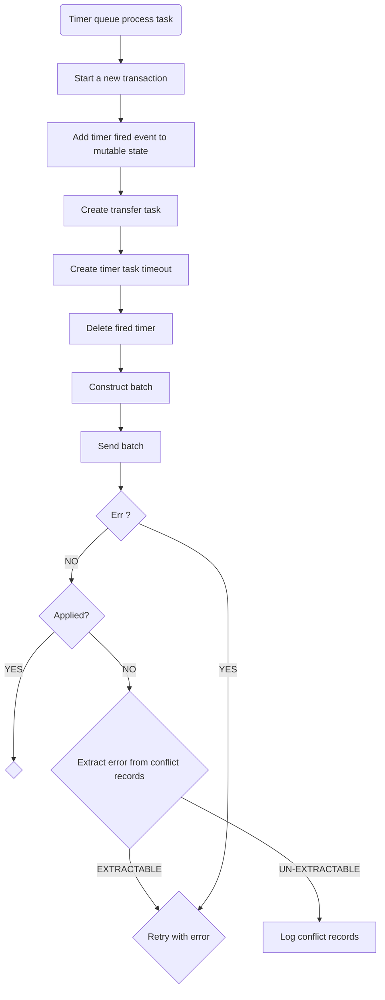

```mermaid
flowchart TD
    0(Timer queue process task) --> 1[Start a new transaction] --> 2[Add timer fired event to mutable state]  --> 4[Create transfer task] --> 5[Create timer task timeout] --> 6[Delete fired timer] --> 7[Construct batch] --> 8[Send batch] --> 9{Err ?} -- NO --> 10{Applied?} -- YES --> 12{ }
    10 -- NO --> 13{Extract error from conflict records} -- EXTRACTABLE --> 11
    13 -- UN-EXTRACTABLE --> 14[Log conflict records]
    9 -- YES --> 11{Retry with error}
    
    
```